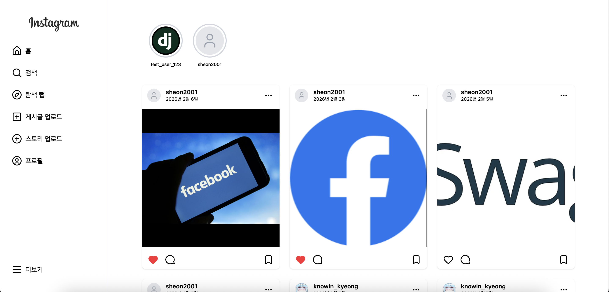
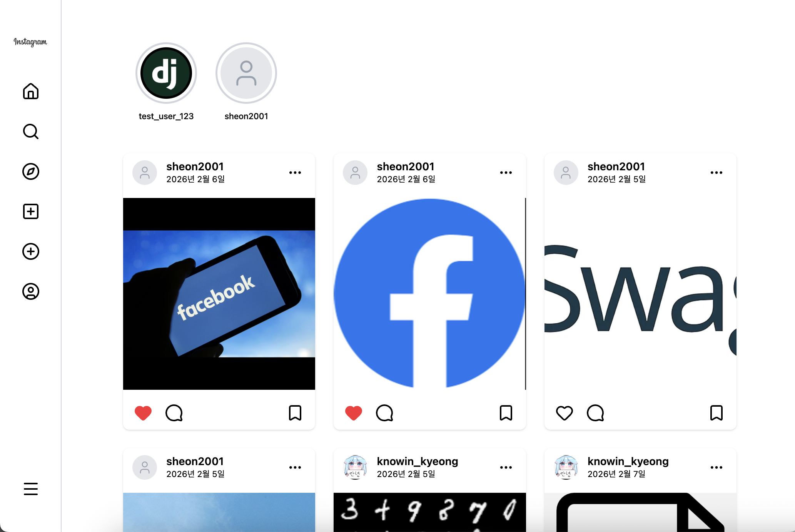
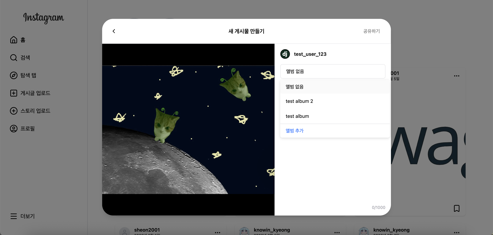
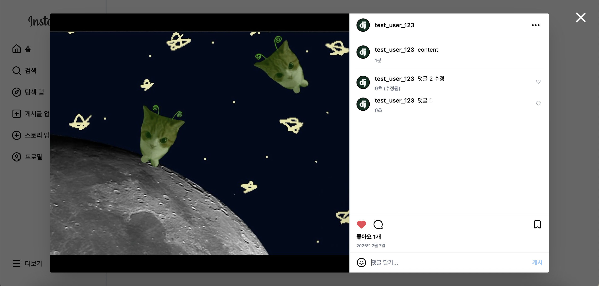
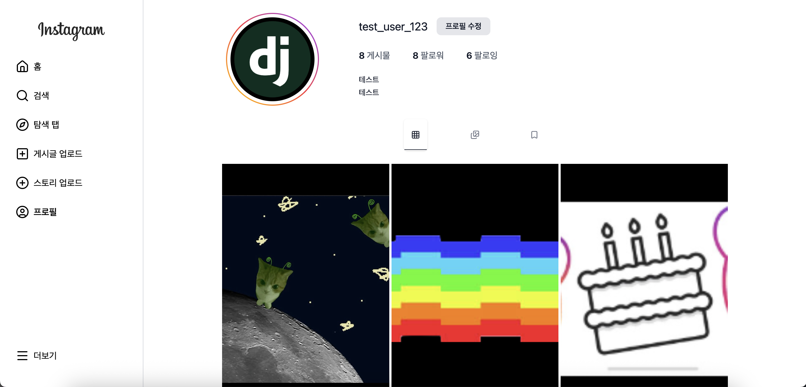
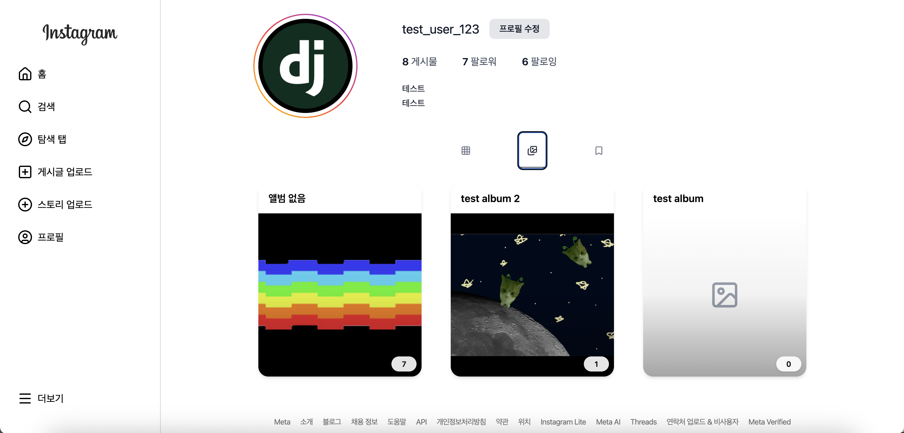
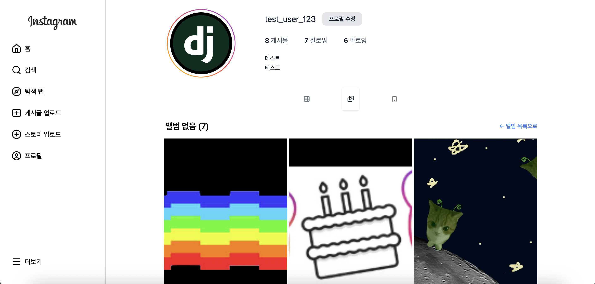
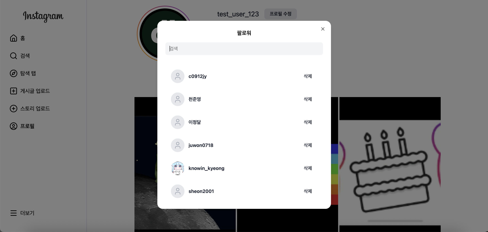
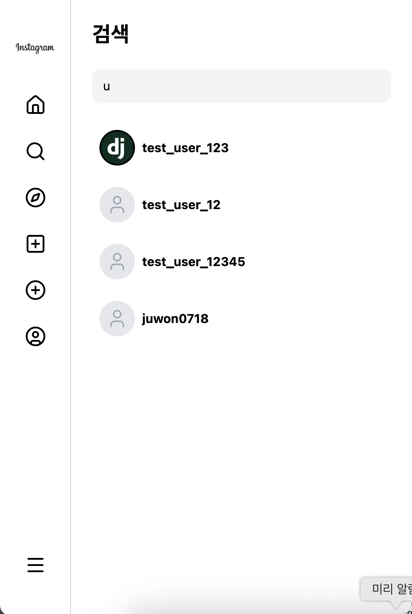

# 1gram

와플스튜디오 23-5 세미나 10조 프론트엔드 레포지토리입니다.

## 서비스 소개

Instagram 클론 웹 서비스로, 기본적인 Instagram의 핵심 기능을 구현하고 **앨범 기능**을 추가했습니다.

- 제외된 주요 기능 : 게시글 동영상 업로드, 릴스, DM
- 추가된 기능 : 앨범을 통해 게시글을 그룹화하여 정리할 수 있는 기능

### 주요 기능

- 게시물 CRUD
- 스토리
- 계정 검색
- 팔로우/언팔로우
- 프로필 편집
- 탐색 페이지
- **앨범**: 게시물을 앨범으로 묶어서 관리
- 반응형 디자인 적용

### 홈 화면 (피드)

게시물 피드와 스토리를 확인할 수 있는 홈 화면입니다. 반응형 디자인으로 화면 크기에 따라 레이아웃이 달라집니다.

#### 큰 화면



#### 중간 화면



#### 작은 화면


### 게시물 작성

여러 장의 사진을 업로드하고 캡션을 작성하여 게시물을 생성할 수 있습니다.
이때 앨범을 생성, 편집, 삭제할 수 있습니다.



### 게시물 상세

게시물의 상세 내용과 댓글을 확인할 수 있습니다.



### 스토리 상세

사용자의 스토리를 풀스크린으로 감상할 수 있습니다.


### 프로필 페이지

사용자의 게시물과 앨범을 탭으로 구분하여 확인할 수 있습니다.



### 앨범 탭

프로필에서 앨범별로 그룹화된 게시물을 확인할 수 있습니다.



### 앨범 상세

특정 앨범에 포함된 게시물 목록을 볼 수 있습니다.



### 팔로우 목록

팔로잉/팔로워 목록을 확인하고 팔로우 관리를 할 수 있습니다.



### 검색

사용자를 검색하고 팔로우할 수 있습니다.



### 탐색 페이지

다양한 게시물을 그리드 형태로 탐색할 수 있습니다.


## 기술 스택

### Core

| 기술       | 버전 | 설명               |
| ---------- | ---- | ------------------ |
| React      | 19   | UI 라이브러리      |
| TypeScript | 5.9  | strict 모드 활성화 |
| Vite       | 7    | 빌드 도구          |

### Styling

- **Tailwind CSS 4** - 유틸리티 기반 CSS
- **tailwind-merge** + **clsx** - 조건부 클래스 병합
- **class-variance-authority (CVA)** - 컴포넌트 variants 관리

### Routing & State

- **TanStack Router** - 타입 안전한 파일 기반 라우팅
- **TanStack Query** - 서버 상태 관리
- **Zustand** - 클라이언트 상태 관리

### UI Components

- **shadcn/ui** - Radix UI 기반, 접근성 준수 및 기본 동작 구현 효율화
- **Framer Motion** - 애니메이션

### API & Validation

- **ky** - HTTP 클라이언트
- **Zod** - 스키마 검증

### Testing & Quality

- **Vitest** + **Testing Library** - 테스트
- **MSW** - API 모킹
- **ESLint** + **Prettier** - 코드 품질

## 프로젝트 구조

Feature-Sliced Design (FSD) 아키텍처 기반으로 진행 중입니다.

```
src/
├── app/                    # 앱 프로바이더 (QueryClient, Theme 등)
├── pages/                  # 페이지 컴포넌트
├── widgets/                # 복합 UI 블록 (독립적인 기능 단위)
├── features/               # 기능별 로직 (사용자 시나리오)
├── entities/               # 비즈니스 엔티티
├── shared/                 # 공유 리소스
│   ├── ui/                # 재사용 UI 컴포넌트
│   ├── lib/               # 유틸리티 함수, hooks
│   ├── api/               # API 클라이언트 설정
│   └── auth/              # 인증 관련
├── routes/                 # TanStack Router 라우트 정의
└── mocks/                  # MSW 목 핸들러
```

## 협업 방식

### Git 브랜치 전략

1. **Issue 생성**: 작업할 내용에 대해 GitHub Issue 생성
2. **브랜치 생성**: Issue 번호 기반으로 브랜치 생성 (예: `123-feature-login`)
3. **PR 생성**: `dev` 브랜치로 Pull Request
4. **코드 리뷰**: CODEOWNERS에 등록된 리뷰어가 자동 할당
5. **머지**: 승인 후 `dev`에 머지
6. **배포**: 주간 회의 후 `main`으로 머지하여 배포

### CODEOWNERS

`.github/CODEOWNERS` 파일을 통해 PR 생성 시 자동으로 리뷰어가 할당됩니다.

```
* @c0912jy @kimnamheeee
```

### 커밋 컨벤션

**Commitizen**을 사용하여 커밋 메시지를 통일합니다.

```bash
yarn commit  # Commitizen 인터랙티브 커밋
```

이모지가 포함된 컨벤셔널 커밋 형식을 사용합니다:

- ✨ `feat`: 새로운 기능
- 🐛 `fix`: 버그 수정
- ♻️ `refactor`: 리팩토링
- 🎨 `style`: 스타일 변경
- 📝 `docs`: 문서 수정
- 🧹 `chore`: 기타 작업

## 워크플로우

### CI/CD

GitHub Actions를 통해 자동화된 파이프라인을 구성했습니다.

**CI Pipeline** (`ci.yml`)

- **트리거**: `dev` 브랜치로 PR 생성 시
- **검사 항목**: ESLint → Type check → Test → Build
- PR에 CI 결과 코멘트 자동 작성
- branch protection으로 CI 통과 및 approval 후 병합 가능

**CD Pipeline** (`cd.yml`)

- **트리거**: `main`, `dev` 브랜치 push
- **배포 대상**: AWS S3 + CloudFront
- 빌드 결과물을 S3에 업로드하고 CloudFront 캐시를 무효화

### Pre-commit Hooks (Husky)

커밋 전 자동으로 코드 품질을 검사합니다:

```bash
# .husky/pre-commit
yarn -s type-check    # TypeScript 타입 검사
yarn -s lint-staged   # 변경된 파일에 대해 lint + format
```

**lint-staged** 설정:

- `*.{ts,tsx,js,jsx}`: Prettier 포맷팅 + ESLint 수정
- `*.{css,scss,md,json,yml,yaml,html}`: Prettier 포맷팅

## 팀원

| 이름   | GitHub                                         | 담당                                                                                         |
| ------ | ---------------------------------------------- | -------------------------------------------------------------------------------------------- |
| 김남희 | [@kimnamheeee](https://github.com/kimnamheeee) | 초기 개발 환경 세팅, 라우트 세팅, 배포, 프로필 페이지 구현, 홈페이지 구현, 탐색 탭 구현      |
| 천준영 | [@c0912jy](https://github.com/c0912jy)         | msw 초기 세팅, 게시글 상세 페이지 구현, 스토리 상세 페이지 구현, 로그인/회원가입 페이지 구현 |
